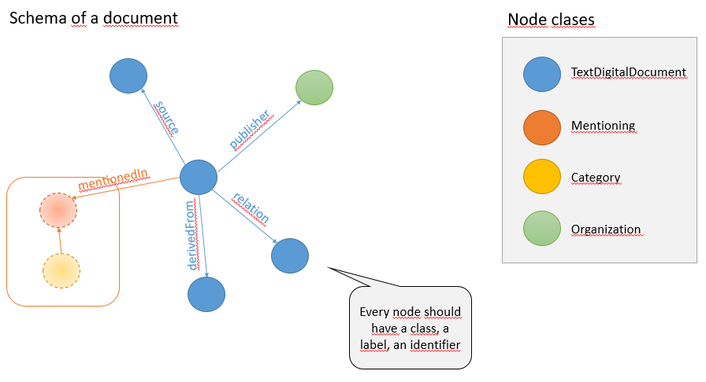
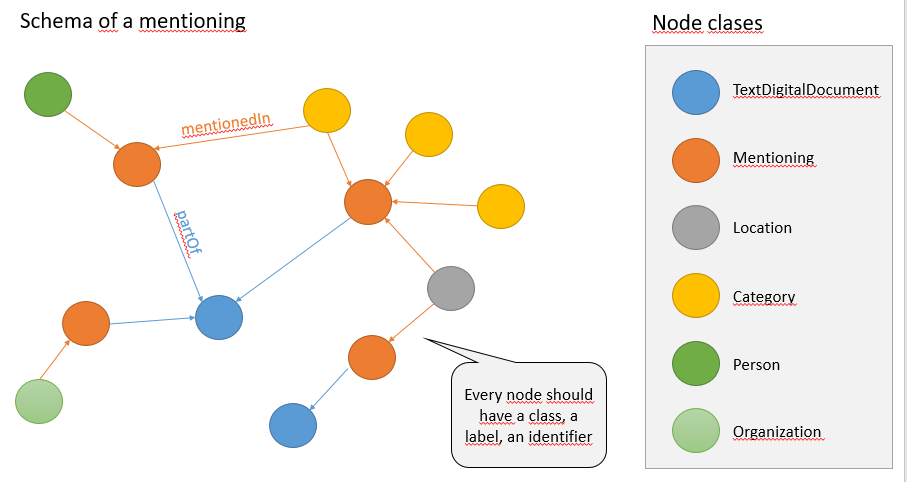

# EIOS-Tooling

small application to query the EIOS elastic search endpoint and convert the result into proper RDF

## installation

* clone the repo from [https://github.com/SCAI-BIO/Web-of-Clint.git](https://github.com/SCAI-BIO/Web-of-Clint.git)
* locate the folder of EIOS-tooling in folder 3-data-RDF-conversion
* switch to main branch
* run maven to build the package (check the corresponding [pom.xml](https://github.com/SCAI-BIO/Web-of-Clint/blob/main/3-data-RDF-conversion/EIOS-tooling/pom.xml))

## commandline calls

arguments

```
usage: EIOS Tooling
 -?,--help                showing argumemts
 -c,--chunksize <arg>     how many documents in one chunk
 -i,--input <arg>         input filename
 -idx,--indexes <arg>     indexes to be queried as a list
 -ip,--inputpath <arg>    filepath to inputs
 -l,--limit <arg>         limit size of EIOS query
 -li,--listindexes        list all indexes
 -m,--mappings <arg>      mappings input file name
 -o,--output <arg>        output file name
 -op,--outputpath <arg>   filepath to outputs
 -pc,--curie              add curie to prefixes
 -q,--query <arg>         category to be searched
 -r,--RDF <arg>           RDF output format
 -s,--output              export SCAIView documents
 -zp,--zipProcess <arg>   input zip file
```

### query the EIOS endpoint

```
java -jar ./target/eiostooling-0.0.1-SNAPSHOT.jar -q ./src/main/resources/input/query-all-2019.json -r TTL -s -l 5000000 -c 1000 -op e: -idx "eios-items_2019"
```
an example of a resulting document can be found here: [eios_401862973_pt.json](https://github.com/SCAI-BIO/Web-of-Clint/blob/main/3-data-RDF-conversion/EIOS-tooling/src/main/resources/input/eios_401862973_pt.json)

larger chunks are zipped - a small test.zip can be found [here](https://github.com/SCAI-BIO/Web-of-Clint/blob/main/3-data-RDF-conversion/EIOS-tooling/src/main/resources/input/test.zip) 


### process a zip file from a query result -> output RDF turtle and SCAIView documents

```
java -jar ./target/eiostooling-0.0.1-SNAPSHOT.jar -zp "./input/eios-items_2020-08.zip" -op "./output/"  -r TTL -s
```
this will produce four different RDF files in zipped [Turtle format](https://www.w3.org/TR/turtle/) (c.f. [output](https://github.com/SCAI-BIO/Web-of-Clint/tree/main/3-data-RDF-conversion/EIOS-tooling/src/main/resources/output))
 * the orginal EIOS document converted into RDF, i.e. the meta data (author, publicher, date, ...) and the content (title, text, ...)
 * a mentioning of relevant ecategories in the text (NLP taggings by the EIOS pipeline), i.e. a text snippet (sentence) where a EIOS category has been tagged and mapped to an ontology (the mappings of the categories are loaded from the resources using a mapping file)
 * a mapping of all structured data to ontology conceptsusing the Web Annotation Ontology [AO](https://www.w3.org/ns/oa) with full provenance using [PROV-O](https://www.w3.org/TR/prov-o/)
 * a SCAIView document (json) whichi can be used to further process and text mine the EIOS documents (add ontology annotations and mappings).The annotated SCAIView results can be converted into proper RDF using this tooling 

#### schema and example of the RDF document

each document is a TextDigitalDocument whicih is linked to the original source item, the derived document in the Elastic Search index, the publisher and related documents having the same content (e.g. a re-tweet).



```
@prefix schema: <http://schema.org/> .
@prefix gn:    <https://sws.geonames.org/> .
@prefix skos:  <http://www.w3.org/2004/02/skos/core#> .
@prefix rdfs:  <http://www.w3.org/2000/01/rdf-schema#> .
@prefix dbpedia: <http://dbpedia.org/resource/> .
@prefix scai:  <https://www.scai.fraunhofer.de/> .
@prefix dc11:  <http://purl.org/dc/elements/1.1/> .
@prefix oa:    <http://www.w3.org/ns/oa#> .
@prefix rdf:   <http://www.w3.org/1999/02/22-rdf-syntax-ns#> .
@prefix dcterms: <http://purl.org/dc/terms/> .
@prefix wgs84_pos: <http://www.w3.org/2003/01/geo/wgs84_pos#> .
@prefix prov:  <http://www.w3.org/ns/prov#> .
@prefix foaf:  <http://xmlns.com/foaf/0.1/> .
@prefix who:   <https://int.who/> .

who:laverdad-46f0b162341780f4b2075635490579e4
        a       <https://schema.org/webFeed> .

who:burgosconecta-46f0b162341780f4b2075635490579e4
        a                    <https://schema.org/webFeed> ;
        prov:wasDerivedFrom  who:laverdad-46f0b162341780f4b2075635490579e4 .

who:Document_401863008
        a                    <https://schema.org/TextDigitalDocument> ;
        dc11:coverage        "European News" ;
        dc11:creator         <https://www.who.int/initiatives/eios> ;
        dc11:date            "2023-01-02T15:40:00Z" ;
        dc11:description     "Los españoles cada vez pasan menos tiempo delante de la televisión tradicional. Con la vuelta a la normalidad, y tras el fin de la época más dura de la pandemia, que sirvió para reactivar momentáneamente un consumo televisivo que iba en decadencia, la audiencia opta por otro tipo de contenidos alternativos al que ofrecen las cadenas tradicionales."@es , "The spanish each time spend less time in front of the traditional television. With the return to normality, and after the end of the time most of the pandemic, which served to revive momentarily a television consumption that was in decline, the hearing opting for another type of content that offer alternative to traditional chains."@es ;
        dc11:format          "application/json" ;
        dc11:identifier      "EIOS:401863008" ;
        dc11:language        "Spanish; Castilian" ;
        dc11:publisher       <https://www.burgosconecta.es/> ;
        dc11:relation        "laverdad-46f0b162341780f4b2075635490579e4" ;
        dc11:source          <https://www.burgosconecta.es/culturas/tv/espectadores-television-consumo-20230102145136-ntrc.html> ;
        dc11:subject         "EMR" , "AF" , "Gathering" , "EUR" , "ES:Spain" , "Qatar" , "EURO" , "EU" , "Marruecos" , "QA:Qatar" , "MA:Morocco" , "AS" , "EMRO" , "Madrid" ;
        dc11:title           "Viewers see less television: consumption falls to its lowest in three decades"@en , "Los espectadores ven menos televisión: el consumo cae a su cifra más baja en tres décadas"@es ;
        dc11:type            "webnews" ;
        schema:text          "Los españoles cada vez pasan menos tiempo ..."@es ;
        prov:wasDerivedFrom  who:burgosconecta-46f0b162341780f4b2075635490579e4 .
        
<https://www.burgosconecta.es/>
        a                           dc11:publisher ;
        rdfs:label                  "burgosconecta"@es ;
        dc11:coverage               "National" ;
        dc11:date                   "2019-10-16T12:45:21.4250000Z" ;
        dc11:identifier             "10672" ;
        dcterms:accrualPeriodicity  "daily" , "2" ;
        foaf:name                   "burgosconecta"@es .
```

#### schema and example of a mentioning

each mentioning is a snippet of a EIOS document. All tagged categories are linked to the mentioning. Each mentioning does have at least a location from [geonames](https://www.geonames.org/) associated. Persons and organisations are mapped to [DBPedia](https://www.dbpedia.org/). 



```
category:PAHO  a          who:Category ;
        rdfs:label        "Colombia"@es , "Argentina"@en ;
        dc11:identifier   "category:PAHO" ;
        EIOS:mentionedIn  who:TextElement_b5f3ddef-7db5-3cf1-b703-4598ab571cba , who:TextElement_dab15909-804b-32af-9f7f-e58d00130a0a , who:TextElement_6201a911-e471-383a-a9d0-18bc8ff93e05 .

<https://sws.geonames.org/5128638/>
        a                 dcterms:Location ;
        rdfs:label        "Nova York"@pt ;
        dc11:identifier   "gn:5128638" ;
        EIOS:mentionedIn  who:TextElement_0853782a-2b3f-3391-bae3-19e2bc2cc633 , who:TextElement_e20ac65f-94a0-39c1-874f-6fa6bfd65105 .

who:TextElement_6201a911-e471-383a-a9d0-18bc8ff93e05
        a                 EIOS:Mentioning ;
        rdfs:label        "Paris Saint-Germain head coach, Christophe Galtier, has confirmed that superstar player, Lionel Messi, will return to training on Tuesday, January 3. Galtier also urged PSG fans to remember what Messi has done since the start of the season with the team now that the Argentina captain has achieved...." ;
        dc11:identifier   "TextElement_6201a911-e471-383a-a9d0-18bc8ff93e05" ;
        EIOS:partOf       EIOS:Document_401863354 ;
        EIOS:publishedAt  who:Day_2023-01-02 .

who:TextElement_2c527bef-aa8b-3315-bd4e-d8807daf06ba
        a                 EIOS:Mentioning ;
        rdfs:label        "Over 60 russian military deaths in an attack in Donetsk ukrainian" ;
        dc11:identifier   "TextElement_2c527bef-aa8b-3315-bd4e-d8807daf06ba" ;
        EIOS:partOf       EIOS:Document_401863009 ;
        EIOS:publishedAt  who:Day_2023-01-02 .

who:TextElement_1b351f82-47f0-3531-bac0-19e6df0dd9d9
        a                 EIOS:Mentioning ;
        rdfs:label        "Primera masacre del año: cuatro muertos tras ataque en Río de Oro, Cesar" ;
        dc11:identifier   "TextElement_1b351f82-47f0-3531-bac0-19e6df0dd9d9" ;
        EIOS:partOf       EIOS:Document_401863331 ;
        EIOS:publishedAt  who:Day_2023-01-02 .

category:Vaccinationrisks
        a                 who:Category ;
        rdfs:label        "morte"@pt ;
        dc11:identifier   "category:Vaccinationrisks" ;
        EIOS:mentionedIn  who:TextElement_e20ac65f-94a0-39c1-874f-6fa6bfd65105 .

who:TextElement_981a0d9b-8dfd-3ef4-a41f-2408d74939ad
        a                 EIOS:Mentioning ;
        rdfs:label        "CIUDAD DEL VATICANO.- Una fila interminable de fieles atravesó hoy la basílica de San Pedro para despedir al papa emérito Benedicto XVI, procesionando ante su cuerpo en medio de un silencio reverencial y el ritmo sin pausa de una antigua letanía. Los restos de Ratzinger, fallecido el sábado con 95...." ;
        dc11:identifier   "TextElement_981a0d9b-8dfd-3ef4-a41f-2408d74939ad" ;
        EIOS:partOf       EIOS:Document_401863010 ;
        EIOS:publishedAt  who:Day_2023-01-02 .

EIOS:Document_401863293
        a                schema:TextDigitalDocument ;
        rdfs:label       "4 positions of yoga to sleep better"@en , "4 posturas de yoga para dormir mejor"@es ;
        dc11:identifier  "EIOS:401863293_en" , "EIOS:401863293_es" .
```
