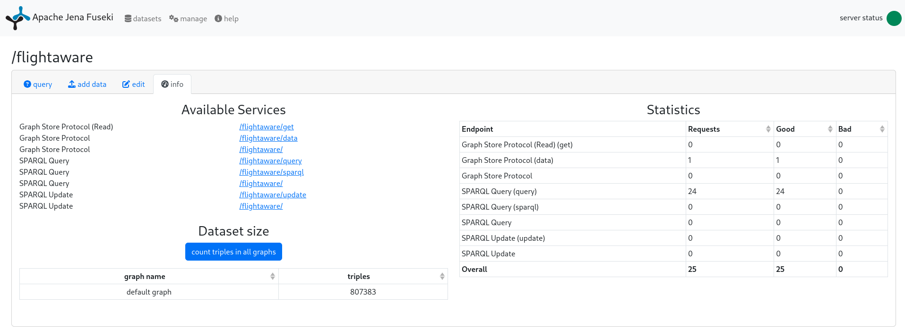

# Loading Converted RDF (TTL) into a Triplestore Using the GUI
For pre-selection purposes the converted and also free available datasets of interest were loaded into a triplestore database.

## TDB
A triplestore is a database for storing and retrieving triples over a query language like SparQL.
There are lots of freely available and also commercial triplestore applications on the web.
For a oversight (partly including benchmarks) visit [Wikipedia: LargeTripleStores](https://en.wikipedia.org/wiki/Triplestore), for example.

### Apache Jena Fuseki
[Apache Jena fuseki](https://jena.apache.org/documentation/fuseki2/) is a [SPARQL](https://www.w3.org/TR/rdf-sparql-query/) server integrated with [Apache TDB](https://jena.apache.org/documentation/tdb/index.html) 
to provide a transactional persistent storage layer.

### Semantic Computing Research Group
The [Semantic Computing Research Group (SeCo)](https://seco.cs.aalto.fi/) 
provides a Docker image which uses Apache Jena Fuseki and Apache TDB as the underlying triplestore database.
While the usage of [Apache Fuseki Docker](https://jena.apache.org/documentation/fuseki2/fuseki-docker.html) is also possible 
the [SeCo image](https://hub.docker.com/r/secoresearch/fuseki/) provides a more configurable and more performant application
with a useful and stable UI.

## Triples
A triple is a data entity in the form

```
subject - predicate - object
```

### SPARQL Query Example:
```
PREFIX rdf: <http://www.w3.org/1999/02/22-rdf-syntax-ns#>
PREFIX rdfs: <http://www.w3.org/2000/01/rdf-schema#>
SELECT * WHERE {
  ?sub <http://flights.scai.fraunhofer.de/ontology#destination> <https://sws.geonames.org/3099426/> .
} LIMIT 1000
```

In this example we are looking for all **flights with destination** (<http://<area>flights.scai.fraunhofer.de/ontology#destination>) **Paris, Charles de Gaulle Airport** which is defined by the geonames identifier (<https://sws.geonames.org/3099426/>).

The flight data is available in the [SCAI Triplestore](https://triplestore.scaiview.com) in dataset **flightaware**.



## Preparation and deployment of Fuseki Triplestore
To deploy the secoresearch/fuseki Docker image we used to build a pre-configured Docker image on a dedicated Docker registry and deploy the image on our internal Kubernetes cluster.

```
cd path/to/secoresearch-fuseki
build -t "docker.example.com/secoresearch-fuseki:0.0.1" -t "docker.example.com/secoresearch-fuseki:latest" -f Dockerfile
```

This will create 2 Docker images, one with version "0.0.1" and one with version tag "latest".

After building the images you have to push them onto a dedicated docker registry:

```
docker login docker.example.com
docker push "docker.example.com/secoresearch-fuseki:0.0.1"
docker push "docker.example.com/secoresearch-fuseki:latest"
```

OR run the locally built Docker image on your host:
```
docker run --rm -it -p 3030:3030 --name fuseki -e ADMIN_PASSWORD=[PASSWORD] -e ENABLE_DATA_WRITE=[true|false] -e ENABLE_UPDATE=[true|false] -e ENABLE_UPLOAD=[true|false] -e QUERY_TIMEOUT=[number in milliseconds] --mount type=bind,source="$(pwd)"/fuseki-data,target=/fuseki-base/databases secoresearch/fuseki
```
See further information at [secoresearch/fuseki](https://hub.docker.com/r/secoresearch/fuseki/).

### To run secoresearch/fuseki on kubernetes:

There are k8s configuration files available in folder kubernetes/secoresearch-fuseki.

**secoresearch-fuseki-data-persistentvolumeclaim.yaml**

Configure the ```storageClassName``` to match the configuration of your k8s cluster.
Configure the size of the PVC in value ```storage```

```
apiVersion: v1
kind: PersistentVolumeClaim
metadata:
  creationTimestamp: null
  labels:
    io.kompose.service: secoresearch-fuseki-data
  name: secoresearch-fuseki-data
spec:
  storageClassName: rook-ceph-block-hdd
  accessModes:
    - ReadWriteOnce
  resources:
    requests:
      storage: 100Gi
```

**secoresearch-fuseki-deployment.yaml**

```
apiVersion: apps/v1
kind: Deployment
metadata:
  labels:
    component: backend
    deployment-id: secoresearch-fuseki
  name: secoresearch-fuseki-deployment
spec:
  replicas: 1
  selector:
    matchLabels:
      component: secoresearch-fuseki
      deployment-id: secoresearch-fuseki
  strategy:
    type: Recreate
  template:
    metadata:
      labels:
        component: secoresearch-fuseki
        deployment-id: secoresearch-fuseki
    spec:
      securityContext:
        fsGroup: 0
      containers:
        - env:
          - name: QUERY_TIMEOUT
            value: "360000"
          - name: ADMIN_PASSWORD
            valueFrom:
              secretKeyRef:
                name: scainet-fuseki-who-secret
                key: password
          - name: USERNAME
            valueFrom:
              secretKeyRef:
                name: scainet-fuseki-who-secret
                key: username
          image: docker.example.com/secoresearch-fuseki:latest
          name: secoresearch-fuseki
          imagePullPolicy: Always
          ports:
            - name: secoresearch
              containerPort: 3030
              protocol: TCP
          resources: {}
          volumeMounts:
            - mountPath: /fuseki-base/databases
              name: secoresearch-fuseki-data
              subPath: databases
            - mountPath: /fuseki-base/configuration
              name: secoresearch-fuseki-data
              subPath: configuration
            - mountPath: /fuseki-base/staging
              name: secoresearch-fuseki-data
              subPath: staging
            - mountPath: /fuseki-base/backups
              name: secoresearch-fuseki-data
              subPath: backups
      restartPolicy: Always
      volumes:
        - name: secoresearch-fuseki-data
          persistentVolumeClaim:
            claimName: secoresearch-fuseki-data
```

**secoresearch-fuseki-ingress.yaml**

Configure the **host**

```
apiVersion: networking.k8s.io/v1
kind: Ingress
metadata:
  name: secoresearch-fuseki-service-ingress
  #namespace: xxx
  annotations:
    nginx.ingress.kubernetes.io/proxy-connect-timeout: "300s"
    nginx.ingress.kubernetes.io/proxy-send-timeout: "300s"
    nginx.ingress.kubernetes.io/proxy-read-timeout: "300s"
    nginx.ingress.kubernetes.io/proxy-body-size: 10g
  labels:
    component: secoresearch-fuseki
    deployment-id: secoresearch-fuseki
spec:
  ingressClassName: nginx
  rules:
    - host: triplestore.example.com
      http:
        paths:
          - path: /
            pathType: Prefix
            backend:
              service:
                name: secoresearch-fuseki-service
                port:
                  name: "secoresearch"
```

**secoresearch-fuseki-secret.yaml**

To create an encrypted username and password use the following command on a terminal:
```
echo -n 'username_to_encrypt' | base64
echo -n 'password_to_encrypt' | base64
```
Add the output of each to the yaml file.

```
apiVersion: v1
kind: Secret
metadata:
  name: secoresearch-fuseki-secret
type: Opaque
data:
  username: encrypted_username
  password: encrypted_password

```

**secoresearch-fuseki-service.yaml**

```
apiVersion: v1
kind: Service
metadata:
  labels:
    component: secoresearch-fuseki
    deployment-id: secoresearch-fuseki
  name: secoresearch-fuseki-service
spec:
  ports:
    - name: "secoresearch"
      port: 3030
      targetPort: 3030
  selector:
    component: secoresearch-fuseki
    deployment-id: secoresearch-fuseki
```

Then run ```kubectl apply```:

```
cd path/to/kubernetes/secoresearch-fuseki
kubectl apply -f .
```
